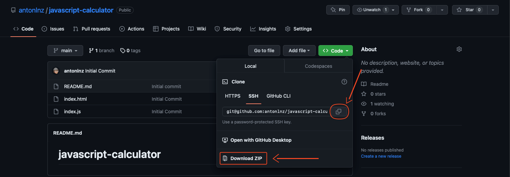
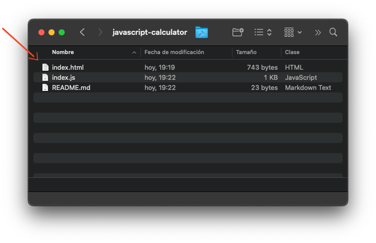
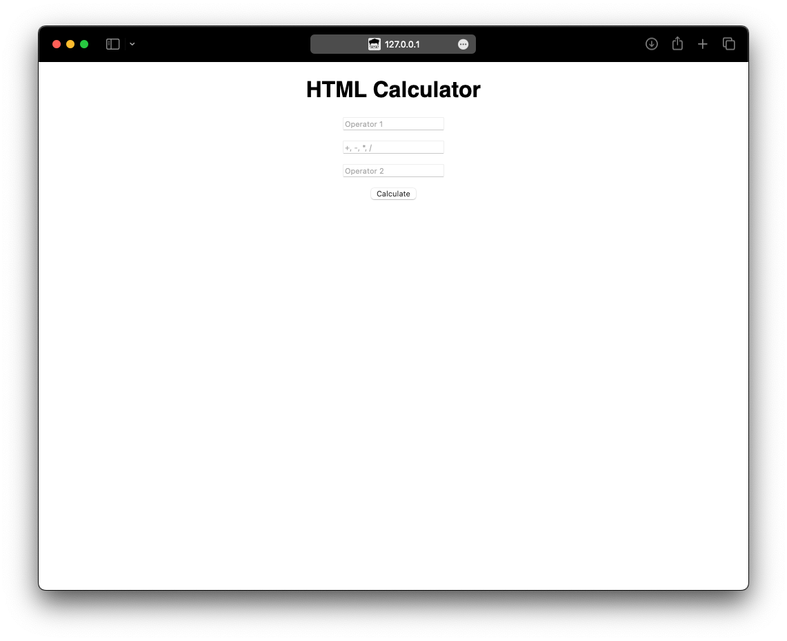
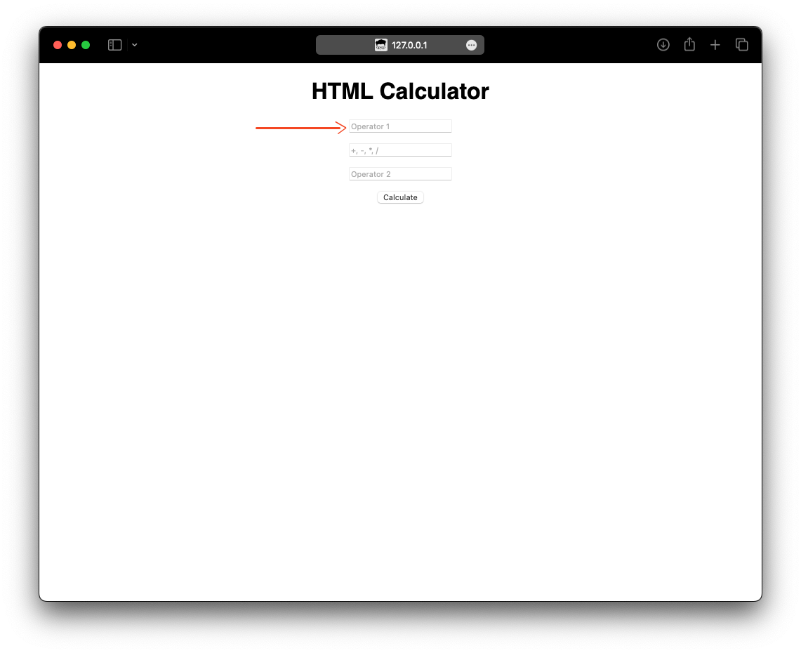
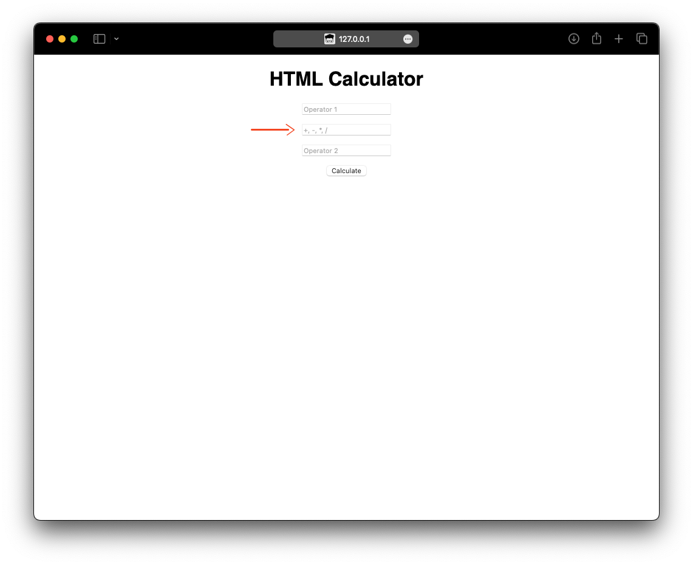
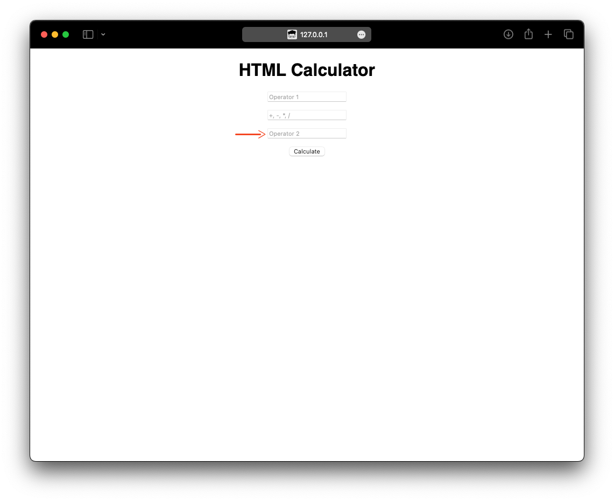
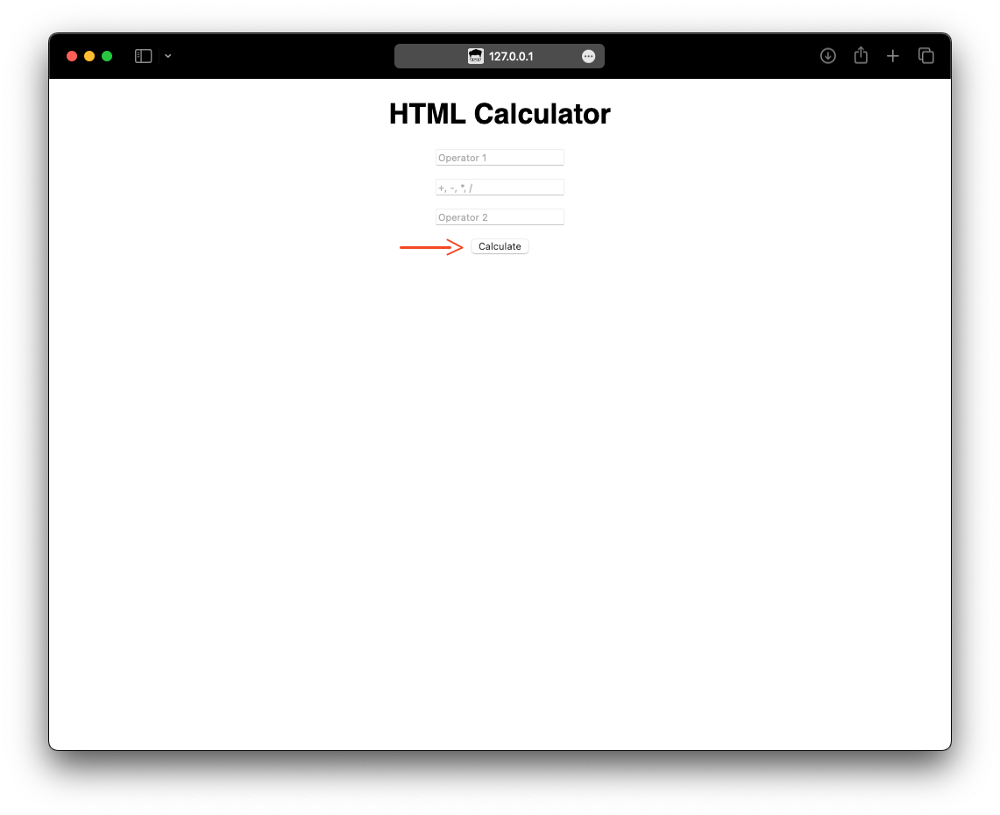
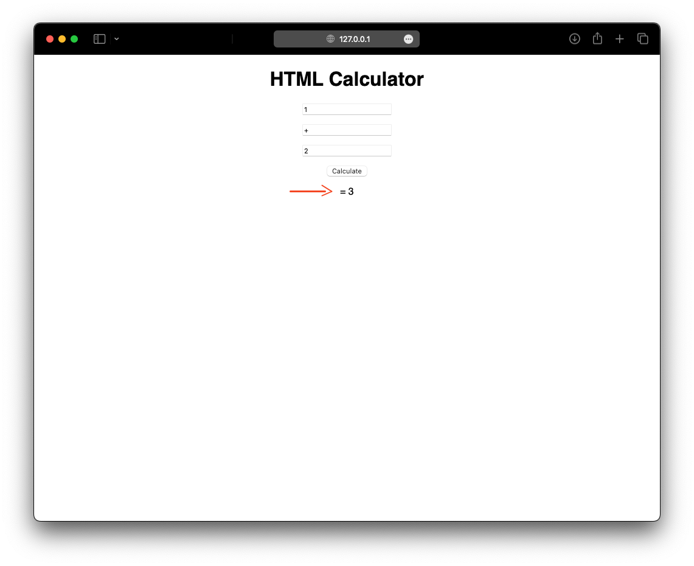
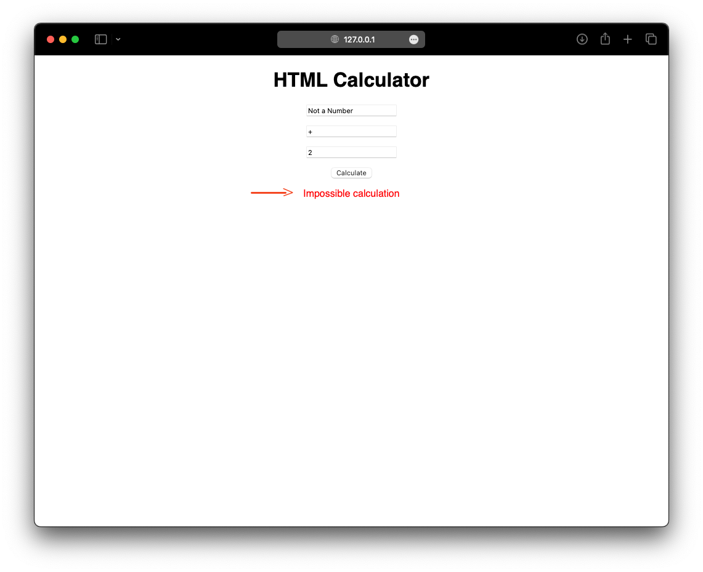

# JavaScript Calculator
This is a simple calculator wrote in JavaScript as a side project to learn JavaScript.

# Instructions for use of the calculator
1. Dowload the source code, you can do it either in zip file or by cloning the repository.

2. Open the HTML file in a web browser.

3. On the calculator web page, you will see three input fields: "Operator 1", "Operation", and "Operator 2".

4. Enter a number in the "Operator 1" field.
   

5. Enter one of the allowed mathematical operations ("+", "-", "*", "/") in the "Operation" field.

6. Enter another number in the "Operator 2" field.

1. Click the "Calculate" button.

1. If you have entered the values correctly, the result of the mathematical operation will be displayed below the "Calculate" button.

9.  If you have entered incorrect values, an error message will be displayed instead of the result.

That's it! Now you can use the Javascript calculator in your web browser.